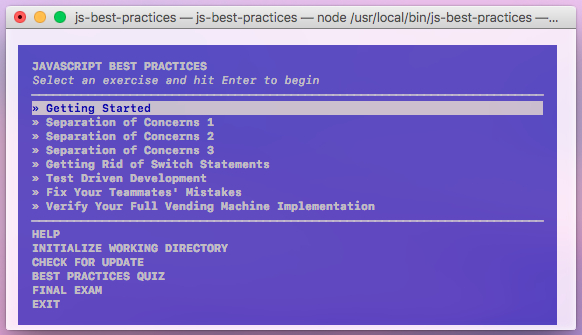

# 💛 JS BEST PRACTICES 😎

### Getting Started
1. Make sure you have installed:   
  * [node.js](https://nodejs.org/en/)  
  * A text editor (we recommend [VS Code](https://code.visualstudio.com/) or [Sublime](http://www.sublimetext.com/2))
2. Run the command `npm install -g js-best-practices`.
3. Make a new folder `mkdir jsbp` and `cd jsbp`
4. Run the command `js-best-practices` to start the workshopper!
